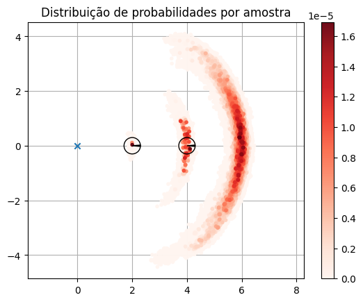
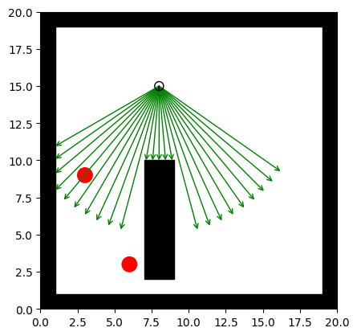
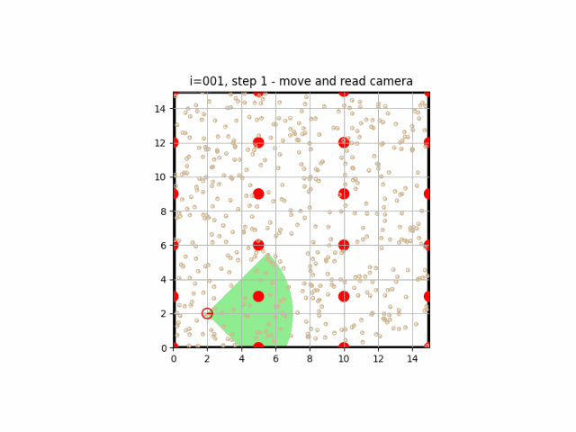
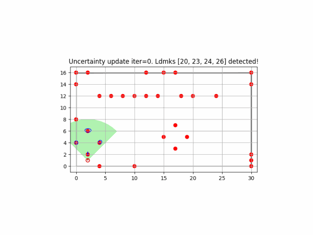
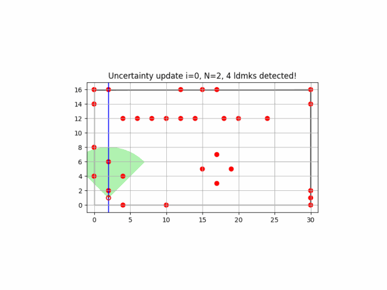
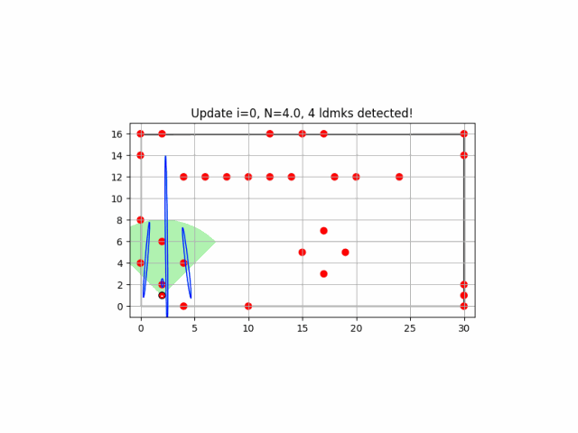

Repository for my python implementations of the algorithms from the classic book Probabilistic Robotics (http://www.probabilistic-robotics.org/)
by Sebastian Thrun, Wolfram Burgard, and Dieter Fox. The codes are part
of the assessment of the UFRJ/COPPE course COE841 - Autonomous Systems, for my master degree.

The proposed algorithms are from the following chapters:
- Chapter 5: Motion Models

- Chapter 6: Perception Models

    
  
  
- Chapter 8: Monte Carlo and Grid Localization

- Chapter 10: SLAM
  - EKF SLAM known correspondences
   
  

  - EKF SLAM
   
  

- Chapter 13: 
  - FastSLAM 1.0

  
  
  - FastSLAM 2.0
   
  

