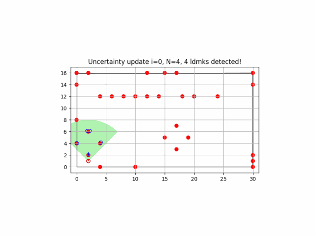

Repository for my python implementations of the algorithms from the classic book Probabilistic Robotics (http://www.probabilistic-robotics.org/)
by Sebastian Thrun, Wolfram Burgard, and Dieter Fox. The codes are part
of the assessment of the UFRJ/COPPE course COE841 - Autonomous Systems, for my master degree.

The proposed algorithms are from the following chapters:
- Chapter 5: Motion Models
- Chapter 6: Perception Models
- Chapter 8: Monte Carlo and Grid Localization
  
- Chapter 10: SLAM
  
- Chapter 13: FastSLAM

